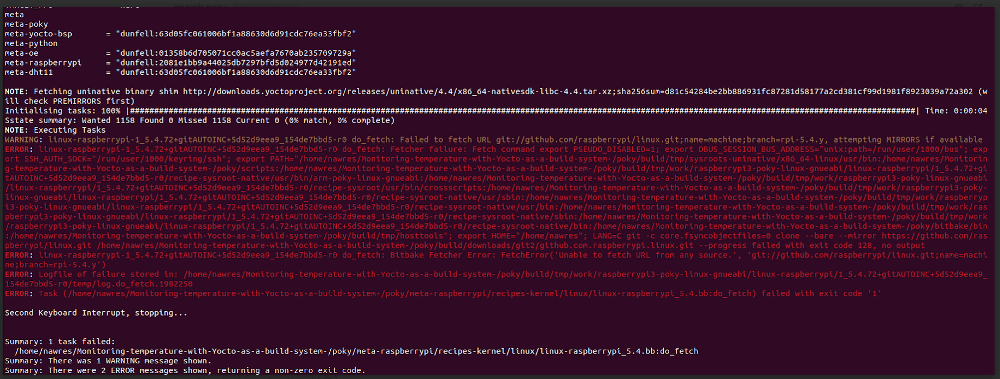

# Monitoring Temperature with Yocto as a Build System

This project is about monitoring temperature using a Raspberry Pi 3B+ with a DHT11 sensor. I'm using the Yocto Project as a build system to customize the development environment.
## .
when we use yocto as a build system :there is something important we need to know it is the Architecture of our target Machine :
first i want to explain the difference beetwen native compiler and the cross-compiler 
## Native_Compiler -vs-Cross_Compiler 
## Toolchain :
C building process (Preprocessing + Compiler +bAssembler + Linker) + C standerd Libraries (stdio.h ,math.h ..etc )+Bin utils + ....

### Host machine :
for building process (in our case we have X86-64 erchitecture )
### Target machine :
for run the executable code (machine code )((in our case we have ARM  erchitecture  for raspberrypi3B+ ).

 ## cross Compiler :
 if you intend to write a C program that is compiled on a certain host system but must execute on another target system ,then you need to compile it with what's 
 known as a cross compiler or cross toolchain :for example when we have host machine X86-64 (our computer ) and our target is ARM architecture (example :raspbeerypi X)

 ## Native Compiler :
 A native compiler is a type of compiler that generates executable code for the same architecture or platform on which it runs.
 

## BSP (Board Support Package)
You will need a BSP layer to support the Raspberry Pi boards. 
So Yocto Project is providing a meta-raspberrypi layer that contains information related to raspberry pi boards that are required during the build.
so you need to download meta-raspberrypi layer from the poky directory using the flowing command :


    ```
    $ git clone https://git.yoctoproject.org/meta-raspberrypi -b dunfell
    ```
## Configuration file :
### Local.conf :
Configures build-specific parameters like machine, distro ..etc .
 ```
    Machine =raspberrypi3
 ```

### bblayers.conf :
Specifies which layers to include in the build.
 ```
    meta-openembedded/meta-networking \
          "/meta-oe \
          "/meta-python \
    meta-raspberrypi \
```


## About Recipe: virtual/kernel
### Issue: Fetching Kernel Sources Fails in Yocto Recipe

### Problem Description:
When attempting to fetch kernel sources for the virtual/kernel recipe in a Yocto build environment, the do_fetch task fails. 
The following error is observed:



### Solution:
To address the issue and ensure the successful fetching of the kernel sources, follow these steps:


1. **Increase the buffer size used by Git for HTTP transfers**:

    ```bash
    git config --global http.postBuffer 157286400
    ```

    This allows Git to send or receive larger files in one go (up to 150 MB).

2. **Reduce the compression window size**:

    ```bash
   
    git config --global pack.window 1
   
    ```

    This reduces the memory usage during compression, potentially improving performance on some systems.

4. **Disable file compression in Git**:

    ```bash
    git config --global core.compression 0
    ```

    This disables file compression, speeding up Git operations but using more disk space.

5. **Fetch kernel sources using Bitbake**:

    ```bash
    bitbake virtual/kernel -c do_fetch
    ```

    This command downloads the necessary files to build the Linux kernel in a Yocto project.
   
### set an ip address static in a linux image developed in yocto?
there are  several ways to test your  image (using an Ethernet cable, UART protocol..e.g ) ,but in our case  we have Ethernet cable so we need to  set an IP static adress and to connect with our board over the SSH (Secure shell )protocol .
so we will create a custom layer (meta-custom) in this type :
*** To automatically set a static IP in the built image, using systemd-networkd:
```bash
meta-custom
    |_ recipes-core
         |_ systemd
              |_ systemd_%.bbappend
         |_ files
              |_ <iface>.link
              |_ <iface>.network
```
For <iface> you have to set the interface to be configured by systemd-networkd, for example eth0, wlan0, ...

And then we need to create a user manually for raspberry pi ,

## Copy the Image to the SD Card

First, identify the SD card device by running:

```bash
lsblk
```

umount the partitions :

```bash
sudo umount /dev/sdX
```

Next, use \`dd\` to write the image to the SD card:

```bash
sudo dd if=core-image-minimal-raspberrypi3.wic.bz2 of=/dev/sdb bs=4M status=progress conv=fsync
```

This will copy the Yocto image to the SD card.
